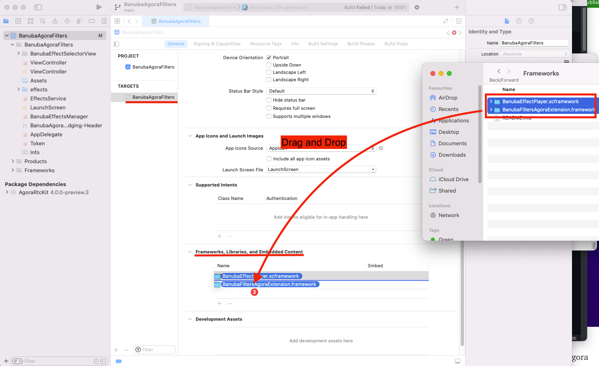

Examples for [Banuba SDK on iOS] and [Agora.io](https://www.agora.io/en/) SDK integration via Agora Plugin Filters to enhance video calls with real-time face filters and virtual backgrounds.

# Getting Started

1. Get
(a)the latest Banuba SDK archive,
(b)[Banuba Extension files for iOS](https://www.banuba.com/faq/how-to-integrate-banuba-sdk-with-agora-sdk),
(c) Banuba trial client token.
To receive a trial token or a full commercial licence from Banuba - please fill in our form on [form on banuba.com](https://www.banuba.com/face-filters-sdk) website, or contact us via [info@banuba.com](mailto:info@banuba.com).
2. Open the BanubaAgoraFilters.xcodeproj file in Xcode and delete the Banuba items from «General->Frameworks, Libraries, and Embedded Content» (do not delete AgoraRtcKit framework), and from the Frameworks folder in the BanubaAgoraFilters project structure (the left part of Xcode window).

<p align="center">
  
</p>

3. Put the received `BanubaEffectPlayer.xcframework` and `BanubaFiltersAgoraExtension.framework` to the “Frameworks, Libraries, and Embedded Content” section in your project.
<p align="center">
  
</p>

4. Copy and Paste your Banuba client token into the appropriate section of `/BanubaAgoraFilters/Token.swift` with “ ” symbols. For example: 
``` swift
let banubaClientToken = "Banuba Token"
```
5. Visit agora.io to sign up and get the token, app and channel ID.

6. Copy and Paste your agora token, app and chanel ID into appropriate section of `/BanubaAgoraFilters/Token.swift` with “ ” symbols. For example: 
``` swift
internal let agoraAppID = "Agora App ID"
internal let agoraClientToken = "Agora Token"
internal let agoraChannelId = "Agora Channel ID"
```
7. Open the BanubaAgoraFilters.xcodporj project in Xcode and run the `BanubaAgoraFilters` target.

:exclamation: If you have any problems with installing Agora frameworks with Swift Package Manager refer to this [page](https://github.com/agorabuilder/AgoraRtcEngine_iOS_Preview)

# How to use `BanubaFiltersAgoraExtension`

To control `BanubaFiltersAgoraExtension` with Agora libs look available keys listed below:
```swift
public struct BanubaPluginKeys {
  public static let vendorName = "Banuba"
  public static let extensionName = "BanubaFilter"
  public static let loadEffect = "load_effect"
  public static let unloadEffect = "unload_effect"
  public static let setEffectsPath = "set_effects_path"
  public static let setToken = "set_token"
}
```

To enable/disable `BanubaFiltersAgoraExtension` use the following method:
```swift
import BanubaFiltersAgoraExtension

agoraKit?.enableExtension(
    withVendor: BanubaPluginKeys.vendorName,
    extension: BanubaPluginKeys.extensionName,
    enabled: true
)
```

Before applying an effect on your video you have to initialize `BanubaFiltersAgoraExtension` with the path to effects and banuba client token. Look how it can be achieved:
```swift
agoraKit?.setExtensionPropertyWithVendor(
    BanubaPluginKeys.vendorName,
    extension: BanubaPluginKeys.extensionName,
    key: BanubaPluginKeys.setEffectsPath,
    value: "place_path_to_effects_folder_here"
)
    
agoraKit?.setExtensionPropertyWithVendor(
    BanubaPluginKeys.vendorName,
    extension: BanubaPluginKeys.extensionName,
    key: BanubaPluginKeys.setToken,
    value: "place_your_banuba_token_here".trimmingCharacters(in: .whitespacesAndNewlines)
)
```

After those steps you can tell `BanubaFiltersAgoraExtension` to enable or disable the mask:

```swift
agoraKit?.setExtensionPropertyWithVendor(
    BanubaPluginKeys.vendorName,
    extension: BanubaPluginKeys.extensionName,
    key: BanubaPluginKeys.loadEffect,
    value: "put_effect_name_here"
)
  
agoraKit?.setExtensionPropertyWithVendor(
    BanubaPluginKeys.vendorName,
    extension: BanubaPluginKeys.extensionName,
    key: BanubaPluginKeys.unloadEffect,
    value: " "
)
```

If the mask has parameters and you want to change them, you can do it the next way:

```swift
agoraKit?.setExtensionPropertyWithVendor(
    BanubaPluginKeys.vendorName,
    extension: BanubaPluginKeys.extensionName,
    key: BanubaPluginKeys.callJSMethod,
    value: jsonString
)      
```
`callJsMethod` must be a JSON string with two fields: `method` and `params`. The`method` field stands for method’s name and `params` for method’s parameters. You can find an example in our [sample](https://github.com/Banuba/agora-plugin-filters-ios/blob/main/BanubaAgoraFilters/ViewController.swift#L181).

# How to build `BanubaFiltersAgoraExtension`

To build the BanubaFiltersAgoraExtension manually, please follow the steps bellow:

1. Launch project `/BanubaFilters/BanubaFiltersAgoraExtension.xcodeproj`.

2. Choose "File->Packages->Reset Package Cashes" from Xcode menu.

3. Build `BanubaFiltersAgoraExtension`. It will be built with your Swift version. After this you should open the section `Products` in the `Project Navigator` (the left part of the Xcode screen). Click on the `BanubaFiltersAgoraExtension` with the right click of the mouse and choose «Show in Finder». Copy the `BanubaFiltersAgoraExtension.framework` from the folder.

4. Then put the framework to the `/Frameworks` folder of the BanubaAgoraFilters.xcodeproj (or of your project). Then you can build BanubaAgoraFilters or your project.

The reconnection of the `BanubaFiltersAgoraExtension.framework` to the example project may be required. To do it, you should remove the `BanubaFiltersAgoraExtension.framework` from the Project Settings: "General-> Frameworks, Libraries and Embedded Content". Then you should drag&drop the `BanubaFiltersAgoraExtension.framework` to this section. You should choose «Embed&Sign» for this framework.

# Effects managing

To retrieve effects list use the following code:

```swift
let effectsPath = BanubaEffectsManager.effectsURL.path
let effectsService = EffectsService(effectsPath: effectsPath)
let effectViewModels = effectsService
    .getEffectNames()
    .sorted()
    .compactMap { effectName in
        guard let effectPreviewImage = effectsService.getEffectPreview(effectName) else {
          return nil
        }

        let effectViewModel = EffectViewModel(image: effectPreviewImage, effectName: effectName)
        return effectViewModel
      }
```

`EffectViewModel` has the next properties:
```swift
class EffectViewModel {
    let image: UIImage
    let effectName: String?
    var cancelEffectModel: Bool {
        return effectName == nil
    }
}
```

To modify effects, add or remove effect folder in `BanubaAgoraFilters/effects` directory.
By default sample contains the following effects:
1. ElvisUnleashed
2. EnglandEightPieceCap
3. FashionHistory1940_male
4. MorphingHatBow
5. MorphTeenegers
6. Nerd
7. Popeye
8. SnapBubblesGlasses
9. Space
10. StarGlow_low
11. TitanicJack
