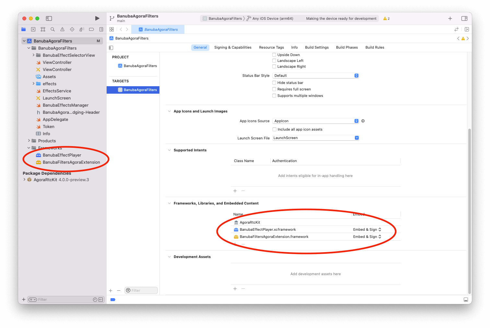

Examples for [Banuba SDK on iOS](https://docs.banuba.com/face-ar-sdk/ios/ios_overview) and [Agora.io](https://www.agora.io/en/) SDK integration via Agora Plugin Filters to enhance video calls with real-time face filters and virtual backgrounds.

# Getting Started

1. Get the latest Banuba SDK archive and BanubaFiltersAgoraExtension for iOS and the client token. Please fill in our form on [form on banuba.com](https://www.banuba.com/face-filters-sdk) website, or contact us via [info@banuba.com](mailto:info@banuba.com).
2. Put received `BanubaEffectPlayer.xcframework` adn `BanubaFiltersAgoraExtension.framework` to “Frameworks, Libraries, and Embedded Content” section in your project.
3. Copy and Paste your banuba client token into appropriate section of `/BanubaAgoraFilters/Token.swift` with “ ” symbols. For example: 
``` swift
let banubaClientToken = “place_your_banuba_token_here”
```
4. Visit agora.io to sign up and get token, app and channel ID.
5. Put received `Agoraffmpeg.framework` and `AgoraRtcKit.framework` to “Frameworks, Libraries, and Embedded Content” section in your project.

&nbsp;

6. Copy and Paste your agora token, app and chanel ID into appropriate section of `/BanubaAgoraFilters/Token.swift` with “ ” symbols. For example: 
``` swift
internal let agoraAppID = "place_your_agora_app_id_here"
internal let agoraClientToken = "place_your_agora_client_token_here"
internal let agoraChannelId = "place_your_agora_channel_id_here"
```
7. Open the BanubaAgoraFilters.xcodporj project in Xcode and run the `BanubaAgoraFilters` target.


# How to use `BanubaFiltersAgoraExtension`

To control `BanubaFiltersAgoraExtension` with Agora libs look available keys listed below:
```swift
public struct BanubaPluginKeys {
  public static let vendorName = "Banuba"
  public static let extensionName = "BanubaFilter"
  public static let loadEffect = "load_effect"
  public static let unloadEffect = "unload_effect"
  public static let setEffectsPath = "set_effects_path"
  public static let setToken = "set_token"
}
```

To enable/disable `BanubaFiltersAgoraExtension` use the following method:
```swift
import BanubaFiltersAgoraExtension

agoraKit?.enableExtension(
    withVendor: BanubaPluginKeys.vendorName,
    extension: BanubaPluginKeys.extensionName,
    enabled: true
)
```

Before applying an effect on your video you have to initialize `BanubaFiltersAgoraExtension` with the path to effects and banuba client token. Look how it can be achieved:
```swift
agoraKit?.setExtensionPropertyWithVendor(
    BanubaPluginKeys.vendorName,
    extension: BanubaPluginKeys.extensionName,
    key: BanubaPluginKeys.setEffectsPath,
    value: "place_path_to_effects_folder_here"
)
    
agoraKit?.setExtensionPropertyWithVendor(
    BanubaPluginKeys.vendorName,
    extension: BanubaPluginKeys.extensionName,
    key: BanubaPluginKeys.setToken,
    value: "place_your_banuba_token_here".trimmingCharacters(in: .whitespacesAndNewlines)
)
```

After those steps you can tell `BanubaFiltersAgoraExtension` to enable or disable the mask:

```swift
agoraKit?.setExtensionPropertyWithVendor(
    BanubaPluginKeys.vendorName,
    extension: BanubaPluginKeys.extensionName,
    key: BanubaPluginKeys.loadEffect,
    value: "put_effect_name_here"
)
  
agoraKit?.setExtensionPropertyWithVendor(
    BanubaPluginKeys.vendorName,
    extension: BanubaPluginKeys.extensionName,
    key: BanubaPluginKeys.unloadEffect,
    value: " "
)
```


# Effects managing

To retrieve effects list use the following code:

```swift
let effectsPath = BanubaEffectsManager.effectsURL.path
let effectsService = EffectsService(effectsPath: effectsPath)
let effectViewModels = effectsService
    .getEffectNames()
    .sorted()
    .compactMap { effectName in
        guard let effectPreviewImage = effectsService.getEffectPreview(effectName) else {
          return nil
        }

        let effectViewModel = EffectViewModel(image: effectPreviewImage, effectName: effectName)
        return effectViewModel
      }
```

`EffectViewModel` has the next properties:
```swift
class EffectViewModel {
    let image: UIImage
    let effectName: String?
    var cancelEffectModel: Bool {
        return effectName == nil
    }
}
```

To modify effects, add or remove effect folder in `BanubaAgoraFilters/effects` directory.
By default sample contains the following effects:
1. ElvisUnleashed
2. EnglandEightPieceCap
3. FashionHistory1940_male
4. MorphingHatBow
5. MorphTeenegers
6. Nerd
7. Popeye
8. SnapBubblesGlasses
9. Space
10. StarGlow_low
11. TitanicJack